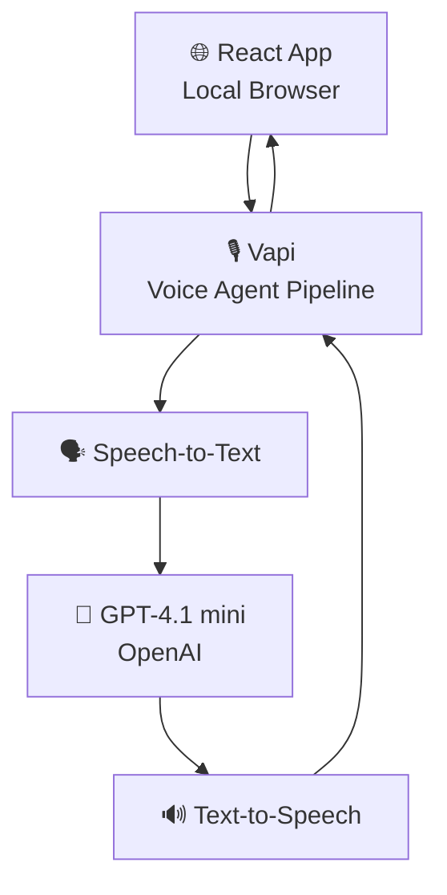
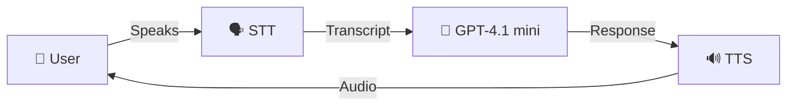
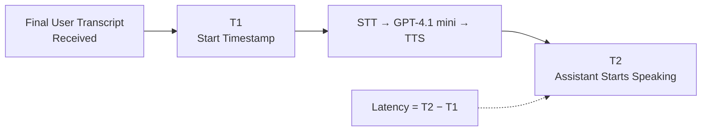
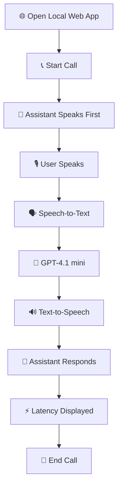

# 🎙️ Local Voice AI Agent

A simple, locally running voice AI agent built with **React, Vapi, and GPT-4.1 mini**.

The project provides a minimal voice conversation experience:

**User speaks → Speech-to-Text → GPT-4.1 mini → Text-to-Speech → User hears response**

The interface also displays the current call status, conversation transcripts, and end-to-end voice response latency.

## ✨ Features

* 🎙️ Browser-based voice interaction
* 🧠 GPT-4.1 mini as the LLM
* 🗣️ Speech-to-Text through Vapi
* 🔊 Text-to-Speech through Vapi
* 📞 Start and end calls
* 💬 User and assistant transcripts
* ⚡ Voice response latency displayed in milliseconds
* 🎨 Simple, responsive React interface
* 🔐 API keys kept in environment variables
* 💻 Runs locally with Vite

## 🏗️ Architecture



### Voice Pipeline



## 🛠️ Tech Stack

| Category        | Technology                     |
| --------------- | ------------------------------ |
| Frontend        | React 19                       |
| Build Tool      | Vite                           |
| Voice Agent     | Vapi                           |
| LLM             | GPT-4.1 mini                   |
| Speech-to-Text  | Vapi-configured STT provider   |
| Text-to-Speech  | Vapi-configured voice provider |
| Language        | JavaScript                     |
| Package Manager | npm                            |

## 📁 Project Structure

```text
voice-ai-agent/
├── src/
│   ├── App.jsx
│   ├── main.jsx
│   └── ...
├── public/
├── .env
├── .gitignore
├── package.json
├── package-lock.json
└── README.md
```

## ⚙️ Environment Variables

Create a `.env` file in the project root:

```env
VITE_VAPI_PUBLIC_KEY=your_vapi_public_key
VITE_VAPI_ASSISTANT_ID=your_vapi_assistant_id
```

### Security

The Vapi **public key** is intended for browser-side use.

Do **not** put private API keys or secret credentials in React code or variables prefixed with `VITE_`.

Never commit `.env` to GitHub.

Your `.gitignore` should include:

```gitignore
node_modules/
.env
.env.*
!.env.example
```

## 🚀 Local Setup

### 1. Clone the repository

```bash
git clone <your-repository-url>
cd voice-ai-agent
```

### 2. Install dependencies

```bash
npm install
```

### 3. Configure environment variables

Create `.env`:

```env
VITE_VAPI_PUBLIC_KEY=your_vapi_public_key
VITE_VAPI_ASSISTANT_ID=your_vapi_assistant_id
```

### 4. Start the development server

```bash
npm run dev
```

Open the local URL shown by Vite, normally:

```text
http://localhost:5173
```

## 🎯 Voice Agent Configuration

The Vapi assistant is configured with:

* **LLM:** GPT-4.1 mini
* **Transcriber:** Vapi-configured STT
* **Voice:** Elliot v2
* **Conversation style:** Short, conversational, and natural
* **First message:** Model-generated opening message

The goal is a reasonably natural voice experience rather than highly realistic voice cloning.

## ⚡ Latency Measurement

The application measures **voice response latency** rather than page-load or connection latency.

The measurement is approximately:



The application uses `performance.now()` to measure the elapsed time and displays the result in milliseconds.

### Important Limitation

The browser/Vapi event flow does not expose the exact acoustic moment when the user physically stops speaking in a way that is always available to the application.

Therefore, the current implementation uses the **final user transcript event** as the starting timestamp.

This makes the metric practical and consistent for this project, although it is not a perfect measurement of raw acoustic end-of-speech latency.

## 🔄 Basic User Flow



## 🧪 Testing

Verify the following before demonstrating the project:

* [ ] Local app starts successfully
* [ ] Start Call works
* [ ] Browser microphone permission works
* [ ] Assistant speaks
* [ ] User speech is transcribed
* [ ] GPT-4.1 mini generates a response
* [ ] Assistant response is spoken
* [ ] User transcript appears
* [ ] Assistant transcript appears
* [ ] Latency appears in milliseconds
* [ ] End Call works
* [ ] No API secrets are committed
* [ ] Production/build errors are resolved

## 💰 Cost Considerations

The application uses Vapi and a hosted LLM/voice pipeline, so **voice calls can consume paid credits depending on the configured Vapi account and providers**.

Development should therefore use short test calls and monitor the remaining Vapi credits.

The application itself does not require a database, authentication, or a paid hosting service for local development.

## 🔒 Security Notes

* Never hardcode secret API keys.
* Never commit `.env`.
* Never expose private provider API keys in frontend JavaScript.
* Only browser-safe/public credentials should be used in Vite client-side environment variables.
* If a future architecture requires private API keys, move those operations to a server-side backend.

## 📌 Current Scope

This project intentionally stays small.

### Included

* Local React application
* Vapi voice pipeline
* GPT-4.1 mini
* STT
* TTS
* Simple voice UI
* Call status
* Transcripts
* Latency measurement

### Not Included

* Authentication
* Database
* User accounts
* Chat history
* Analytics dashboard
* Complex animations
* Voice cloning
* Unnecessary backend services

Additional features should only be added if they are required by the project/team lead.

## 🗺️ Development Phases

| Phase   | Description                                      | Status     |
| ------- | ------------------------------------------------ | ---------- |
| Phase 0 | Requirements, architecture, technology decisions | ✅ Complete |
| Phase 1 | Local React/Vite environment setup               | ✅ Complete |
| Phase 2 | Vapi assistant and voice pipeline setup          | ✅ Complete |
| Phase 3 | Basic STT → LLM → TTS voice interaction          | ✅ Complete |
| Phase 4 | Simple React UI                                  | ✅ Complete |
| Phase 5 | Voice response latency                           | ✅ Complete |
| Phase 6 | Voice naturalness improvement                    | ✅ Complete |
| Phase 7 | End-to-end testing and debugging                 | 🔄 Next    |
| Phase 8 | Security and configuration cleanup               | 📋 Planned |
| Phase 9 | Final local demo and documentation               | 📋 Planned |

## 👨‍💻 Author

**Aditya Jha**

* GitHub: https://github.com/Aaditya1834
* LinkedIn: https://www.linkedin.com/in/aditya-jha-583552268
* Portfolio: https://portfolio-r9p8.vercel.app/

---

Built as a lightweight local voice AI agent focused on a simple, working voice interaction experience.
